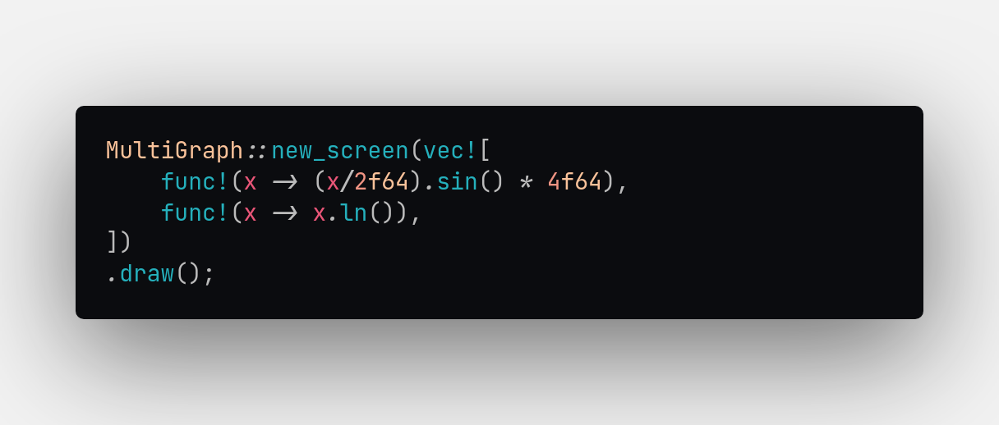

# `tgraph`

Plain-simple Rust crate providing for drawing graphs in the terminal based on a function. It provides an interface for drawing the graph of a function by passing a Rust closure/function, also enabling you to draw multiple functions inside the same graph.

## Roadmap

- [x] Drawing graph with single function
- [x] Drawing graph with multiple functions
- [x] Customize function display _(only color and character as of now, more to come)_
- [ ] Option to limit graph height
- [ ] Interactive graphs: move and zoom
- [ ] Draw negative values
- [ ] More ideas to come! Drop yours in the [issues tab](https://github.com/hipycas/tgraph/issues)!

## Usage

To draw a function, a wrapper that represents a graph is used. There are two types of graphs: a single function graph (`Graph`) and a multiple function graph (`MultiGraph`). Although you could just use `MultiGraph`, for single functions `Graph` is recommended, as `MultiGraph` adds some code not needed just for one function.

Both structs provide the same interface. To create a graph (used `Graph` for simplicity, for `MultiGraph` see the [docs](https://docs.rs/tgraph)), you use `Graph::new(f, width: u32, height: Option<u32>)` where `f` is the function/closure (further explained below) and `height` is automatically set if `None` is passed, or you can also use `Graph::new_screen(f, height: Option<u32>)` which picks up the width of the screen. If you want to customize the graph with options, you can call `Graph::with_options` and `Graph::with_options_screen` respectively and pass a `GraphOptions` struct as last parameter.

Functions that can be drawn are restricted to types that implement the `tgraph::AsF64` trait, which allows the parameters of the function to be created from a `f64` and the result of the function to be converted to a `f64`, as drawing in the screen is made pixel by pixel. You can implement this trait to whichever type you want, meaning that a struct representing people can be drawn as part of a graph is you implement `tgraph::AsF64` on it.

To write functions for the graph, a `func!` macro is provided, which provides a easy and simple syntax to create function instances easier and provide a more straightforward use of functions in `MultiGraph` (due to the fact that functions/closures with same types have different signatures, so you have to append `as fn(X) -> Y`, where `X` and `Y` are the types of the input and output, respectively).

To draw the the graph, it is as simple as calling `.draw()` on `Graph` or `MultiGraph`, and this will draw the graph to the terminal where the binary was executed. Another option that is available, is printing the instance, so if `graph` is your `Graph` or `MultiGraph` instance, `println!("{}", graph)` will print your graph to the screen too (note that debug print will not, just display print).

## Examples

Single function graph:

```rust
Graph::with_options_screen(
    func!(|x| 0.005 * (x * x) + 0.1 * x),
    GraphOptions::builder()
        .color(Color::DarkMagenta.into())
        .build(),
)
.draw();
```

Multiple function graph:

```rust
println!(
    "{}",
    MultiGraph::new(
        vec![
            func!(x -> 10f64 -(x/5f64)),
            func!(x -> f64::sin(x/2f64).abs() * 4f64),
            func!(x -> x.ln()),
        ],
        80,
        None,
    )
);
```

Comparing both examples, you can se the two ways to render the graph, as well as the different ways to declare a function using the `func!` macro.
